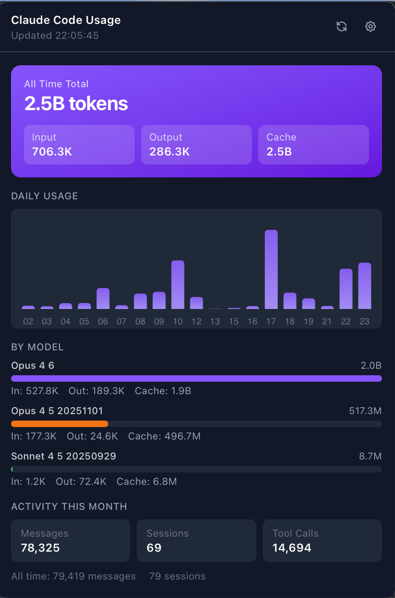

# Claude Token Usage

A lightweight macOS menu bar app that displays your Claude Code token usage. Built with Tauri v2, Svelte 5, and ECharts.




## How It Works

The app reads usage data directly from Claude Code's local stats file (`~/.claude/stats-cache.json`), which is updated automatically each time a Claude Code session ends. No API keys or account configuration required.

### Menu Bar

- Displays current month's total token count (e.g., "915.2K") next to the Claude logo in the macOS menu bar
- Click the icon to open a popover dashboard
- The popover auto-hides when you click away

### Dashboard

- **Token Summary** - All-time totals with input/output/cache breakdown
- **Daily Usage Chart** - Bar chart showing token usage per day for the current month
- **Model Breakdown** - Per-model token usage with proportional bars
- **Activity Stats** - Messages, sessions, and tool calls for the month and all-time

### Data Updates

- A file watcher monitors `~/.claude/stats-cache.json` for changes and updates the UI immediately
- 60-second fallback poll ensures the display stays current
- Stats are written by Claude Code when a session ends, so the current active session's usage won't appear until it completes

## Prerequisites

- **macOS** 10.15+
- **Rust** 1.86+ (`curl --proto '=https' --tlsv1.2 -sSf https://sh.rustup.rs | sh`)
- **Node.js** 18+ and npm
- **Claude Code** installed and used at least once (to generate `~/.claude/stats-cache.json`)

## Getting Started

### Install dependencies

```bash
npm install
```

### Development

Run the app in development mode with hot-reload:

```bash
npx tauri dev
```

### Build

Build the production `.app` bundle:

```bash
npx tauri build --bundles app
```

The built app will be at:
```
src-tauri/target/release/bundle/macos/Claude Token Usage.app
```

You can copy it to `/Applications` or run it directly.

## Tech Stack

| Layer     | Technology                          |
| --------- | ----------------------------------- |
| Framework | Tauri v2 (Rust backend, web frontend) |
| Frontend  | Svelte 5 + TypeScript               |
| Styling   | Tailwind CSS v4                      |
| Charts    | ECharts 5 (tree-shaken imports)      |
| Build     | Vite 6                               |

## Project Structure

```
claude-token-usage/
  src/                      # Frontend (Svelte)
    components/
      Dashboard.svelte      # Main dashboard view
      TokenSummary.svelte   # Token count card
      DailyChart.svelte     # ECharts bar chart
      ModelBreakdown.svelte # Per-model breakdown
      ActivityStats.svelte  # Messages/sessions/tool calls
      Settings.svelte       # Settings/info view
    lib/
      api.ts                # Tauri invoke wrappers
      format.ts             # Number formatting helpers
      types.ts              # TypeScript interfaces
    App.svelte              # Root component (routing)
    app.css                 # Tailwind imports + base styles
    main.ts                 # Entry point
  src-tauri/                # Backend (Rust)
    src/
      lib.rs                # Tray icon, window, stats reading, commands
      polling.rs            # File watcher for stats updates
      main.rs               # Entry point
    icons/                  # App and tray icons
    tauri.conf.json         # Tauri configuration
    Cargo.toml              # Rust dependencies
```

## License

MIT
